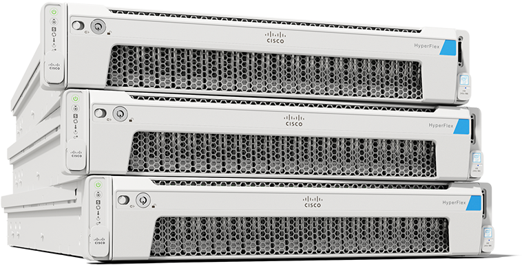

<h1 align="center">HyperFlex Edge Automated Deployment Tool for Cisco Intersight</h1>

<h1 align="center">
  
</h1>  

<p align="center">
  The Cisco HyperFlex Edge Automated Deployment Tool (HX Auto Deploy) for Cisco Intersight enables automated deployment of HyperFlex Edge cluster installations through the Intersight API.
</p>
<br>

[](https://developer.cisco.com/codeexchange/github/repo/ugo-emekauwa/hx-auto-deploy)

## Use Cases
- Automatically build a HyperFlex Edge Cluster Profile with all Policies configured to your exact specification. Anything that can be done through the Intersight GUI can be done here!

- Automatically assign the HyperFlex Edge Cluster Profile to HyperFlex servers registered under Intersight, using either the CIMC/KVM IP addresses or serial numbers.

- Automatically deploy the HyperFlex Edge Cluster Profile to the assigned HyperFlex servers.

- Quickly restore HyperFlex Edge Cluster Profile and Policy configurations as part of your on-prem Intersight backup solution.

- Supported with Intersight SaaS, Connected Virtual Appliance, and Private Virtual Appliance.

## Prerequisites
1. Python 3.7 or higher installed, which can be downloaded from [https://www.python.org/downloads/](https://www.python.org/downloads/).
    - If you're installing for the first time on Windows, select the option **"Add Python 3.x to PATH"** during the installation.
2. Git installed, which can be downloaded from [https://git-scm.com/downloads/](https://git-scm.com/downloads/).
3. Install the Cisco Intersight SDK for Python by running the following command:
   ```
   pip install git+https://github.com/CiscoUcs/intersight-python.git
   ```
   More information on the Cisco Intersight SDK for Python can be found at [https://github.com/CiscoUcs/intersight-python](https://github.com/CiscoUcs/intersight-python).
4. [_Optional_] If you already have the Cisco Intersight SDK for Python installed, you may need to upgrade. An upgrade can be performed by running the following command:
   ```
   pip install git+https://github.com/CiscoUcs/intersight-python.git --upgrade --user
   ```
5. Clone or download the HyperFlex Edge Automated Deployment Tool for Cisco Intersight repository by using the  link on the main repository web page or by running the following command from the target directory:
    ```
    git clone https://github.com/ugo-emekauwa/hx-auto-deploy
    ```
   If you are downloading the repository file as a zipped file, unzip the file once the download has completed.
6. Generate a version 2 API key from your Intersight account.

    **(a).** Log into your Intersight account, click the Settings icon and select **Settings**.
    
      
      
    **(b).** Under the API section in the work pane, click **API Keys**.
    
      
      
    **(c).** In the API Keys section in the work pane, click the **Generate API Key** button.
    
      
      
    **(d).** In the Generate API Key window, enter a description or name for your API key.
    
      
      
    **(e).** In the Generate API Key window, under API Key Purpose, verify a version 2 API key is selected.
    
      
      
    **(f).** In the Generate API Key window, click the **Generate** button.
    
      
      
    **(g).** In the Generate API Key window, a new API key will be generated. Copy the API Key ID and download the Secret Key to a secure location.
    
      
7. Gather the CIMC/KVM IP address or serial number of the servers registered with Intersight that you plan on using in your HyperFlex Edge cluster. You can login to the Intersight GUI and find this information in the **ADMIN/Devices** section under the **Device IP** and **Device ID** columns. HyperFlex Edge with Intersight currently supports 2, 3 or 4 server node clusters.

    

## How to Use
1. Please ensure that the above [**Prerequisites**](https://github.com/ugo-emekauwa/hx-auto-deploy#prerequisites) have been met.
2. Within the unzipped repository, edit the HX_Auto_Deploy.py file to set the **`key_id`** variable using the following instructions:

    **(a).** Open the HX_Auto_Deploy.py file in an IDLE or text editor of choice.
    
    **(b).** Find the comment **`# MODULE REQUIREMENT 1 #`**.
     
      
      
    **(c).** Underneath, you will find the variable **`key_id`**. The variable is currently empty.
    
      
      
    **(d).** Fill in between the quotes of the **`key_id`** variable value with the ID of your API key. For example:
      ```py
      key_id = "5c89885075646127773ec143/5c82fc477577712d3088eb2f/5c8987b17577712d302eaaff"
      ```
3. Edit the HX_Auto_Deploy.py file to set the **`key`** variable using the following instructions:

    **(a).** Open the HX_Auto_Deploy.py file in an IDLE or text editor of choice.
    
    **(b).** Find the comment **`# MODULE REQUIREMENT 2 #`**.
    
      
      
    **(c).** Underneath, you will find the variable **`key`**. The variable is currently empty.
    
      
      
    **(d).** Fill in between the quotes of the **`key`** variable value with your system's file path to the SecretKey.txt file for your API key. For example:
      ```py
      key = "C:\\Keys\\Key1\\SecretKey.txt"
      ```
4. Edit the HX_Auto_Deploy.py file to set all the HyperFlex configuration variable values using the following instructions:

    **(a).** Open the HX_Auto_Deploy.py file in an IDLE or text editor of choice.

    **(b).** Find the comment **`# MODULE REQUIREMENT 3 #`**.
    
      
      
    **(c).** Underneath, you will find the instructions to edit the HyperFlex configuration variable values to match your environment. Each variable has a sample value for ease of use. The variable values to edit begin under the comment **`####### Start Configuration Settings - Provide values for the variables listed below. #######`**.
      
      
   
    Completion of editing the HyperFlex configuration variable values is marked by the comment **`####### Finish Configuration Settings - The required value entries are complete. #######`**.
      
      
5. Save the changes you have made to the HX_Auto_Deploy.py file.
6. Run the HX_Auto_Deploy.py file. Upon a successful deployment, you will be informed that the new HyperFlex cluster profile has been deployed.

    
7. Once the **HX Auto Deploy Tool** has completed running, you can login to the Intersight GUI to see the HyperFlex Edge cluster profile created and in a state of deployment in the **CONFIGURE/Profiles** section.

    

The **HyperFlex Notification Tool** available on GitHub at [https://github.com/ugo-emekauwa/hyperflex-notification-tool](https://github.com/ugo-emekauwa/hyperflex-notification-tool) can be used to receive automated updates on the status of the HyperFlex Edge deployment.

## Where to Demo
The HyperFlex Edge Automated Deployment Tool for Cisco Intersight is featured on Cisco dCloud in the following labs:

1. [_Cisco HyperFlex Edge 5.0 with Intersight v1 (All Flash, 2-Node)_](https://dcloud2-rtp.cisco.com/content/demo/760975) - See the section **Deploy HyperFlex Using API**.
2. [_Cisco HyperFlex Edge 5.0 with Intersight v1 (Hybrid, 2-Node)_](https://dcloud2-rtp.cisco.com/content/demo/760974) - See the section **Deploy HyperFlex Using API**.
3. [_Cisco HyperFlex Edge 5.0 with Intersight v1 (All Flash, 3-Node)_](https://dcloud-cms.cisco.com/demo/cisco-hyperflex-edge-4-5-with-intersight-v1-all-flash-3-node) - See the section **Deploy HyperFlex Using API**.

dCloud is available at [https://dcloud.cisco.com](https://dcloud.cisco.com), where Cisco product demonstrations and labs can be found in the Catalog.

## Related Tools
Here are similar tools to help administer and manage Cisco HyperFlex and UCS environments.
- [Cisco IMM Automation Tools](https://github.com/ugo-emekauwa/cisco-imm-automation-tools)
- [HyperFlex Notification Tool for Cisco Intersight](https://github.com/ugo-emekauwa/hyperflex-notification-tool)
- [Cisco HyperFlex API Token Manager](https://github.com/ugo-emekauwa/hx-api-token-manager)
- [HyperFlex HTML Plug-In Automated Installer](https://github.com/ugo-emekauwa/hx-html-plugin-auto-installer)

## Author
Ugo Emekauwa

## Contact Information
uemekauw@cisco.com or uemekauwa@gmail.com
